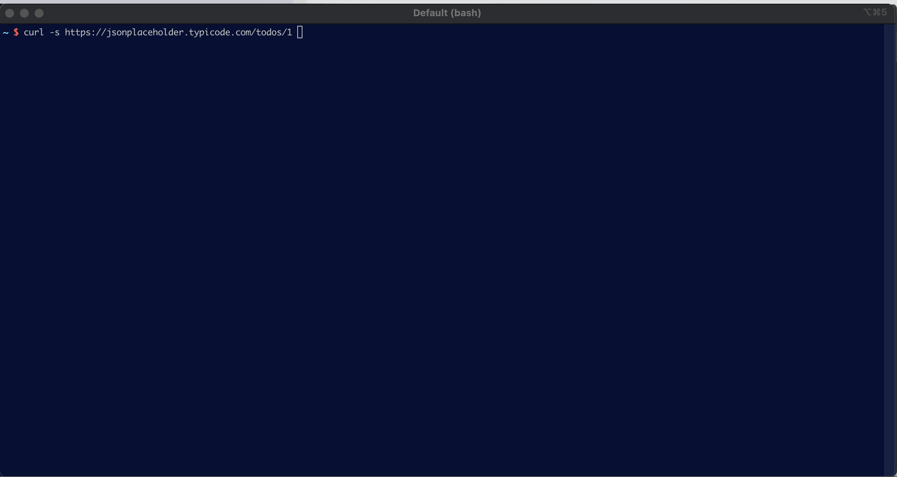

# jqplay-cli

`jqplay-cli` is a fork of the wonderful
[jqplay](https://github.com/owenthereal/jqplay) with a focus on local command
line usage. Play with your JSON data without sending your private data to a
third party server.



You can use the default web-based UI or a [complete terminal-based UI](./demo/README.md#terminal-ui),
all without hitting the internet.

The web-based UI also has support for [JMESPath](https://jmespath.org/)
expressions, making it a handy tool for exploring, in particular AWS APIs.

## Quickstart

```sh
brew install jittering/kegs/jqplay
curl -s https://jsonplaceholder.typicode.com/todos/1 | jqplay
```

## Installation

`jqplay-cli` is built as a single binary containing everything needed to run,
including all static files for the web frontend. Simply download and install it
with one of the following methods:

via homebrew (mac or linux):

```sh
brew install jittering/kegs/jqplay
```

or manually:

Download a [pre-built binary](https://github.com/jittering/jqplay/releases) or
build it from source:

```sh
# requires go, node, npm
git clone https://github.com/jittering/jqplay.git
cd jqplay
make deps
# binary will be written to bin/jqplay
make build
```

## Usage

```text
Usage of jqplay:

  -cli
      CLI mode
  -no-open
      Do not open browser on startup
  -verbose
      Verbose output
  -web
      Web mode (default true)
```

## License

jqplay-cli is released under the [MIT license](./LICENSE.md).

Based on jqplay, also under the [MIT license](https://github.com/owenthereal/jqplay/blob/master/LICENSE.md).
